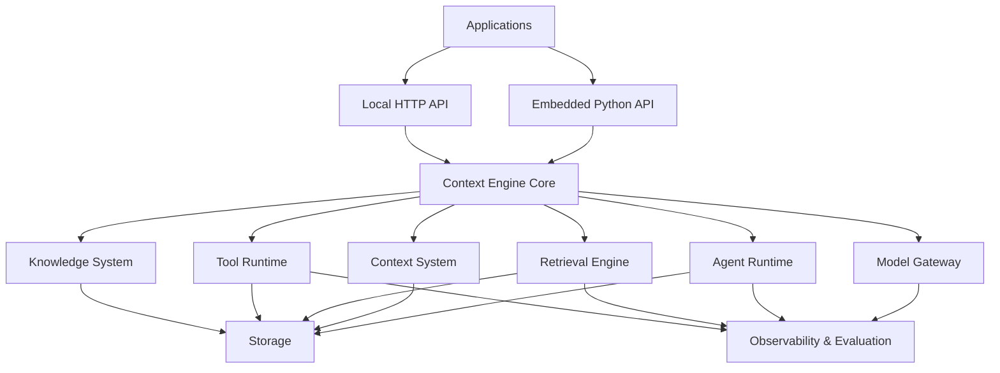

# Context Engine — Architecture Overview

> **Status:** Draft / v1
> **Last updated:** 2026-08-11

## 1. Overview

Context Engine is a local-first context-aware agent runtime for building intelligent, controllable AI applications.

The system is designed around a clear separation between:

* probabilistic model behavior,
* deterministic runtime behavior,
* context and memory,
* retrieval and knowledge,
* tool execution,
* model infrastructure,
* storage,
* observability, and
* evaluation.

The primary design goal is to allow applications to build sophisticated agentic behavior without giving the underlying language model direct control over application state or external side effects.

The architecture is **local-first but not local-only**. The system must be able to run entirely on a developer's local machine while retaining clear interfaces for remote models, external services, and future server deployments.

---

# 2. Architectural Principles

Context Engine follows these core principles.

### 2.1 LLMs propose; the runtime decides

The LLM may propose an action, tool call, or transition, but the Agent Runtime is responsible for validating and executing it.

```text
LLM
 │
 │ proposes
 ▼
Agent Runtime
 │
 │ validates
 ▼
Deterministic Action
```

The model therefore does not directly control application state or external side effects.

### 2.2 Deterministic execution

State transitions, policies, capabilities, tool execution, and persistence must be deterministic and testable independently of the LLM.

### 2.3 Local-first

The development system should be capable of running locally with:

* local application state,
* local vector storage,
* local artifacts,
* and local model inference.

Cloud services may be used when explicitly configured.

### 2.4 Provider independence

The core runtime must not depend directly on a specific:

* LLM provider,
* embedding provider,
* reranker,
* vector database,
* or inference runtime.

Provider-specific implementations belong behind interfaces.

### 2.5 Least privilege

Tools receive only the capabilities required for their operation.

Tool metadata is not considered a security boundary.

### 2.6 Observability by design

Agent executions, model calls, retrieval operations, and tool executions must produce structured telemetry that can be used for debugging, optimization, and evaluation.

### 2.7 Evaluation as a first-class concern

Agent quality must be measurable independently from application availability.

The system should support reproducible evaluation datasets and regression testing.

---

# 3. High-Level Architecture



The major subsystems are:

1. API Layer
2. Agent Runtime
3. Context System
4. Knowledge & Retrieval
5. Tool Runtime
6. Model Gateway
7. Storage
8. Observability & Evaluation

---

# 4. API Layer

Context Engine exposes a canonical domain API through two interfaces.

## 4.1 Embedded API

Applications can embed Context Engine directly.

```python
from context_engine import ContextEngine

engine = ContextEngine()

result = engine.run(...)
```

Embedded mode is intended for:

* local applications,
* rapid development,
* testing,
* experimentation,
* and the initial Context-Aware DJ application.

## 4.2 Local Service API

Context Engine can also run as a local service.

```text
Application
     │
     │ HTTP
     ▼
Context Engine
```

The service allows multiple applications to use the same local Context Engine instance.

## 4.3 Canonical API

Embedded and HTTP interfaces must expose the same underlying semantics.

```text
             Domain API
                 │
        ┌────────┴────────┐
        ▼                 ▼
   Python Adapter     HTTP Adapter
```

The adapters must not implement independent business logic.

The initial service API will use HTTP and JSON with versioned endpoints:

```text
/api/v1/...
```

Streaming support may be added later.

---

# 5. Agent Runtime

The Agent Runtime is the deterministic execution core of Context Engine.

It owns:

* agent state,
* state transitions,
* action validation,
* tool requests,
* execution control,
* run persistence,
* and termination conditions.

## 5.1 Explicit State Machine

Agent execution is represented by an explicit state machine.

Conceptually:

```text
                    ┌───────────┐
                    │   START   │
                    └─────┬─────┘
                          ▼
                    ┌───────────┐
                    │  CONTEXT  │
                    └─────┬─────┘
                          ▼
                    ┌───────────┐
                    │   THINK   │
                    └─────┬─────┘
                          ▼
                  ┌─────────────────┐
                  │ ACTION PROPOSED │
                  └────────┬────────┘
                           ▼
                 ┌──────────────────┐
                 │ RUNTIME VALIDATE │
                 └────────┬─────────┘
                          │
             ┌────────────┼────────────┐
             ▼            ▼            ▼
          Tool Call    Respond      Retry/Fail
             │
             ▼
       Tool Runtime
             │
             ▼
          THINK
```

The LLM does not directly determine state transitions.

The runtime does.

In implementation, transition validation is runtime-owned and deterministic:

* `AgentExecutionState` is a passive immutable state record.
* allowed status transitions are defined explicitly in a runtime transition map.
* invalid transitions fail explicitly, including all transitions from terminal states.

## 5.2 Fixed Runtime Actions

The Agent Runtime owns a closed set of action types.

Applications cannot arbitrarily introduce new runtime state transitions.

Applications extend the system through registered Tools.

This keeps the control flow deterministic while allowing applications to provide domain-specific functionality.

---

# 6. Context System

Context Engine treats context as a first-class subsystem.

The logical Context Store contains:

### Facts

Structured information about entities, preferences, states, or relationships.

### Events

Time-bound observations or actions.

### Memories

Higher-level semantic information derived from facts and events.

Context retrieval combines these sources according to the current task.

## 6.1 Context is not Knowledge

The architecture distinguishes between:

```text
Context
→ information relevant to the current situation

Knowledge
→ information available for retrieval

Memory
→ information retained from previous interactions or events
```

These concepts may share infrastructure but have different semantics and retrieval strategies.

## 6.2 Context Assembly

The Context System produces a bounded context package for the model.

```text
Current Task
     │
     ▼
Context Retrieval
     │
     ├── Facts
     ├── Events
     ├── Memories
     └── Knowledge
     │
     ▼
Context Ranking
     │
     ▼
Context Assembly
     │
     ▼
Model Gateway
```

The goal is to provide the model with relevant information rather than indiscriminately passing all available context.

---

# 7. Knowledge & Retrieval

The Knowledge System provides modern RAG capabilities.

## 7.1 Ingestion Pipeline

Knowledge ingestion is asynchronous.

```text
Artifact
   │
   ▼
Parsing
   │
   ▼
Chunking
   │
   ▼
Metadata Extraction
   │
   ▼
Embedding
   │
   ▼
Indexing
```

Long-running ingestion work must not block normal agent execution.

## 7.2 Hybrid Retrieval

Retrieval combines multiple retrieval strategies.

```text
                 Query
                   │
          ┌────────┼────────┐
          ▼        ▼        ▼
       Vector   Keyword  Structured
       Search   Search    Search
          │        │        │
          └────────┼────────┘
                   ▼
               Fusion
                   │
                   ▼
               Reranking
                   │
                   ▼
             Final Results
```

Vector search is therefore not the only retrieval mechanism.

## 7.3 Retrieval Strategies

The underlying retrieval infrastructure is shared, while strategies are specialized.

```text
Retrieval Engine
│
├── Knowledge Retrieval
├── Memory Retrieval
└── Context Retrieval
```

For example:

**Knowledge Retrieval**

* semantic similarity,
* keyword matching,
* metadata filtering,
* reranking.

**Memory Retrieval**

* semantic similarity,
* recency,
* importance,
* confidence,
* lifecycle.

**Context Retrieval**

* task relevance,
* temporal relevance,
* current constraints,
* semantic relevance.

---

# 8. Tool Runtime

Tools are the mechanism through which applications extend Context Engine.

The runtime owns:

* tool registration,
* schema validation,
* policy enforcement,
* capability checks,
* execution,
* execution isolation,
* and tool telemetry.

## 8.1 Application Tools

Applications may register domain-specific tools.

For example, Context-Aware DJ could provide:

```text
spotify.search_tracks
spotify.get_audio_features
spotify.create_playlist
spotify.add_tracks
```

These tools are controlled by the Context Engine Tool Runtime.

## 8.2 Security Boundary

Tool metadata is not trusted as a security boundary.

A tool may declare its intended behavior, but the runtime must independently enforce:

* capabilities,
* policies,
* execution mode,
* resource limits,
* and access restrictions.

## 8.3 Capability Model

Tools operate under explicit capabilities.

Example:

```text
external.spotify.read
external.spotify.write
context.read
context.write
filesystem.read
filesystem.write
network.http
```

A tool only receives the capabilities explicitly granted to it.

## 8.4 Tiered Execution

Context Engine uses tiered tool execution.

```text
Tool
 │
 ├── Trusted Core
 │       └── In-process
 │
 ├── Application Tool
 │       └── Isolated Worker
 │
 └── Untrusted / Third-party
         └── Sandbox
```

The initial MVP supports:

* in-process execution for trusted core tools,
* isolated worker processes for application tools.

A stronger sandboxed executor is a future extension.

Execution mode is determined by Context Engine policy, not by the tool itself.

---

# 9. Model Gateway

The Model Gateway abstracts model inference from the rest of the system.

Agent Runtime must not depend directly on a specific model provider.

## 9.1 Supported Model Capabilities

The gateway conceptually supports:

```text
Model Gateway
│
├── Chat / Reasoning
├── Embeddings
└── Reranking
```

Future capabilities may include:

* vision,
* speech,
* image generation.

## 9.2 Model Registry

The Model Registry describes available models and their capabilities.

Example properties include:

```text
model_id
provider
capabilities
context_window
supports_tools
supports_structured_output
locality
performance_metadata
```

## 9.3 Model Routing

Applications specify requirements rather than necessarily selecting a concrete provider.

For example:

```text
capability: reasoning
quality: high
latency: balanced
locality: prefer_local
```

The Model Router selects an appropriate model.

Explicit model overrides may be supported where required.

## 9.4 Local and Remote Providers

The gateway supports both local and remote inference.

```text
                 Model Gateway
                       │
              ┌────────┴────────┐
              ▼                 ▼
           Local             Remote
              │                 │
       Model Runtime        Provider API
```

The architecture does not require a specific inference runtime.

## 9.5 Synchronous API with Asynchronous Infrastructure

The Agent Runtime should interact with a simple request/response interface.

Internally, providers may use:

* asynchronous execution,
* streaming,
* queues,
* batching,
* GPU workers,
* or other inference optimizations.

This keeps agent logic independent of inference infrastructure.

## 9.6 Structured Output

The gateway supports structured model outputs.

Model responses are validated before being returned to the deterministic runtime.

```text
Model
  │
  ▼
Raw Output
  │
  ▼
Schema Validation
  │
  ▼
Typed Runtime Input
```

## 9.7 Runtime Model Contract (M2 Foundation)

The current implementation establishes explicit provider-independent boundaries for
runtime-to-model interaction and runtime decision interpretation:

```text
ModelRequest
  - model_id
  - messages[(role, content)]
  - max_output_tokens (optional)
  - temperature (optional)

ModelResponse
  - model_id
  - output_text
  - finish_reason
  - usage (optional)

ModelDecision
  - kind: respond | retry | fail
  - proposed_response (optional, for respond)
```

The runtime depends on a `ModelGateway` interface (`generate(request) -> response`)
rather than any provider SDK.

Runtime interpretation is explicit and deterministic:

```text
ModelResponse
      ↓
interpret_model_response(...)
      ↓
ModelDecision
      ↓
explicit runtime transition
```

The model response does not directly mutate runtime state. The runtime remains the owner
of state transitions.

Decision kinds are runtime-interpreted into valid post-validation transitions:

* `respond` -> `RESPOND`
* `retry` -> `THINK`
* `fail` -> `FAILED`

Model failures are represented through explicit gateway errors:

* `ModelGatewayRequestError` for invalid request boundary conditions
* `ModelGatewayExecutionError` for provider execution failures

Concrete model provider integrations remain out of scope for this stage.

---

# 10. Storage Architecture

Context Engine uses a logical storage abstraction with multiple physical implementations.

The MVP uses:

```text
SQLite
Qdrant
Local Filesystem
```

## 10.1 SQLite

SQLite stores structured and operational information.

Examples:

```text
Facts
Events
Memories
Agent Runs
Tool Executions
Jobs
Metadata
Configuration
```

## 10.2 Qdrant

Qdrant provides vector storage and retrieval.

Examples:

```text
Knowledge embeddings
Memory embeddings
Context embeddings
```

Qdrant is accessed through a `VectorRepository` abstraction.

The rest of Context Engine must not depend directly on Qdrant-specific APIs.

## 10.3 Local Filesystem

The filesystem stores raw artifacts such as:

```text
Documents
PDFs
Images
Other uploaded files
```

The Knowledge System can ingest these artifacts into searchable representations.

## 10.4 Repository Interfaces

Logical storage is exposed through interfaces such as:

```text
ContextRepository
KnowledgeRepository
VectorRepository
ArtifactRepository
AgentRunRepository
EventRepository
```

This allows physical storage implementations to be replaced independently.

---

# 11. Event Log

Context Engine maintains an append-oriented event model for important runtime activity.

Examples include:

```text
AgentStarted
ContextRetrieved
ModelInvoked
ToolRequested
PolicyChecked
ToolExecuted
AgentCompleted
```

The event log supports:

* debugging,
* evaluation,
* replay analysis,
* observability,
* and auditing.

An agent execution should be reconstructable from its recorded runtime events and associated telemetry.

---

# 12. Observability

Observability answers:

> What happened?

Context Engine uses structured telemetry across the major subsystems.

## 12.1 Tracing

Agent executions are represented as traces containing spans.

Example:

```text
Agent Run
│
├── Context Retrieval
│   ├── Vector Search
│   ├── Keyword Search
│   └── Reranking
│
├── Model Invocation
│
├── Tool Execution
│
└── Model Invocation
```

## 12.2 Model Telemetry

The Model Gateway records metrics such as:

```text
latency
time_to_first_token
input_tokens
output_tokens
tokens_per_second
model
provider
errors
```

Local inference may additionally record:

```text
GPU utilization
VRAM usage
CPU utilization
RAM usage
queue time
batch size
```

## 12.3 Retrieval Telemetry

Retrieval operations record information such as:

```text
query
candidate count
retrieval strategy
embedding model
vector store
reranker
top_k
latency
```

Sensitive content must be subject to configurable redaction.

## 12.4 Tool Telemetry

Tool executions record:

```text
tool
version
trust level
execution mode
status
duration
error
```

Tool arguments and results must not automatically be logged without considering privacy and sensitive data exposure.

## 12.5 OpenTelemetry

OpenTelemetry is the intended standard for traces, metrics, and related telemetry.

The architecture remains compatible with local and future hosted observability backends.

---

# 13. Evaluation

Evaluation answers:

> How well did it work?

Evaluation is separate from operational observability while sharing execution telemetry.

```text
Agent Run
    │
    ▼
Trace
    │
    ├── Observability
    │
    └── Evaluation
```

## 13.1 Evaluation Layers

Context Engine evaluates:

```text
Agent behavior
Tool selection
Retrieval quality
Generation quality
End-to-end task success
System performance
```

## 13.2 Retrieval Metrics

Potential retrieval metrics include:

```text
Recall@K
Precision@K
MRR
NDCG
```

## 13.3 Agent Metrics

Potential agent metrics include:

```text
task success
tool selection accuracy
unnecessary tool calls
execution failures
```

## 13.4 Generation Metrics

Potential generation metrics include:

```text
relevance
groundedness
faithfulness
structured-output validity
```

## 13.5 System Metrics

Potential system metrics include:

```text
latency
throughput
resource usage
token usage
cost
```

## 13.6 Evaluation Datasets

Evaluation datasets contain reproducible inputs and expected behavior.

```text
Evaluation Dataset
       │
       ▼
Context Engine
       │
       ▼
Agent Run
       │
       ▼
Trace
       │
       ▼
Evaluator
       │
       ▼
Metrics
```

These datasets enable regression testing as the system evolves.

---

# 14. Development Deployment

Development is the primary deployment target during the initial project phase.

The entire system should run locally on a Windows development machine.

```text
┌──────────────────────────────────────────────┐
│             Windows Development             │
│                                              │
│  ┌────────────────────────────────────────┐  │
│  │          Context Engine                │  │
│  │                                        │  │
│  │  API                                   │  │
│  │  Agent Runtime                         │  │
│  │  Context System                        │  │
│  │  Retrieval                             │  │
│  │  Tool Runtime                          │  │
│  │  Model Gateway                         │  │
│  └────────────────────────────────────────┘  │
│            │            │           │         │
│            ▼            ▼           ▼         │
│         SQLite       Qdrant     Filesystem    │
│                                              │
│                    │                         │
│                    ▼                         │
│             Local Model Runtime              │
└──────────────────────────────────────────────┘
```

Qdrant runs as a separate local service.

SQLite remains embedded in the Context Engine process.

Local model inference is accessed through the Model Gateway.

Docker is not a requirement for the initial development environment.

Future desktop and server deployment models may introduce containers, PostgreSQL, object storage, remote vector databases, or remote model providers without changing the logical architecture.

---

# 15. End-to-End Request Flow

A typical agent request follows this conceptual flow:

```text
Application
    │
    ▼
Context Engine API
    │
    ▼
Agent Runtime
    │
    ├── Retrieve Context
    │       │
    │       └── Retrieval Engine
    │
    ├── Invoke Model
    │       │
    │       └── Model Gateway
    │
    ├── Validate Proposed Action
    │
    ├── Execute Tool
    │       │
    │       └── Tool Runtime
    │
    ├── Persist State
    │
    └── Continue State Machine
```

At every stage, relevant events and telemetry are recorded.

---

# 16. Example: Context-Aware DJ

The initial reference application for Context Engine is a Context-Aware DJ.

A request such as:

> "I'm coding and don't want distracting lyrics. Build a playlist based on what I normally listen to in this situation."

could result in:

```text
User Request
     │
     ▼
Agent Runtime
     │
     ▼
Context Retrieval
     │
     ├── Listening history
     ├── Relevant memories
     └── Current constraints
     │
     ▼
Model Gateway
     │
     ▼
Structured Agent Action
     │
     ▼
Tool Runtime
     │
     ├── Search tracks
     ├── Retrieve metadata
     └── Create playlist
     │
     ▼
External Music Service
```

The important architectural property is that the LLM does not directly manipulate the external service.

It proposes actions.

Context Engine validates and executes them.

---

# 17. Architectural Boundaries

The following boundaries are intentional.

### Agent Runtime ↔ Model Gateway

The Agent Runtime does not know how inference is implemented.

### Agent Runtime ↔ Tool Runtime

The Agent Runtime requests tools; the Tool Runtime controls their execution.

### Retrieval ↔ Storage

Retrieval depends on repository interfaces rather than a specific database.

### Context ↔ Knowledge

Context and knowledge can share retrieval infrastructure but retain separate semantics.

### API ↔ Core

API adapters expose the domain without implementing core business logic.

### Observability ↔ Runtime

Telemetry must not determine core runtime behavior.

---

# 18. Current Technology Strategy

The architecture intentionally distinguishes **architectural decisions** from **implementation choices**.

### Current MVP choices

```text
Language:
Python

Structured storage:
SQLite

Vector storage:
Qdrant

Artifacts:
Local filesystem

Service API:
HTTP + JSON

Embedded API:
Python

Tracing / telemetry:
OpenTelemetry

Deployment:
Local development
```

### Not yet locked

```text
LLM provider
Embedding model
Reranker
Local inference runtime
HTTP framework
Sandbox implementation
Production database
Production object storage
Production observability backend
```

These should be selected based on implementation requirements rather than prematurely embedded into the architecture.

---

# 19. Architecture Evolution

The architecture is intentionally designed for incremental evolution.

Initial development:

```text
Python
SQLite
Qdrant
Local filesystem
Local model
```

Possible future deployment:

```text
Context Engine
│
├── PostgreSQL
├── Qdrant
├── Object Storage
├── Local/Remote Model Serving
└── Observability Infrastructure
```

The goal is to preserve the logical interfaces while replacing infrastructure implementations.

---

# 20. Current Architectural Goal

The target architecture is not to build a generic autonomous agent framework.

The goal is to build a **controllable, observable, local-first context engine** where:

```text
Models provide intelligence.
Runtime provides control.
Context provides relevance.
Retrieval provides knowledge.
Tools provide capabilities.
Policy provides boundaries.
Storage provides persistence.
Telemetry provides visibility.
Evaluation provides measurement.
```

This separation is the foundation on which applications such as Context-Aware DJ can be built.

---

## Status

The architecture described in this document represents the current architectural direction of Context Engine.

Implementation details may change as development progresses.

Significant architectural changes should be documented separately as Architecture Decision Records (ADRs).
